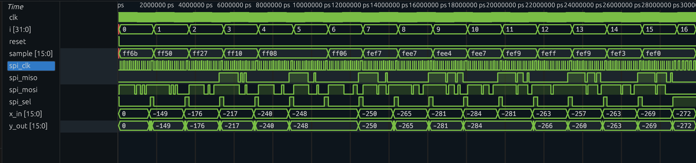

# asic_project
CPE 470 ASIC final project

Simulation of actual audio file filtering with a low alpha (a = 0.25, strong noise supression)
(this uses python as the ADC/DAC interface replacing SPI for fast sampling on a file):

    "make cocotests"
    *Note: input file is a bit loud so volume warning, but output file is lower volume 

Whole SPI interface and rtl level filtering algorithm with a very high alpha (a = ~0.93, subtle smoothing to retain detail):

    "make itests"

    waveform with just 16 samples for clarity
    (since high alpha, x_in and y_out values remain the same or very similar, as seen in the picture below):

    

Use "make openlane" for on-chip design
